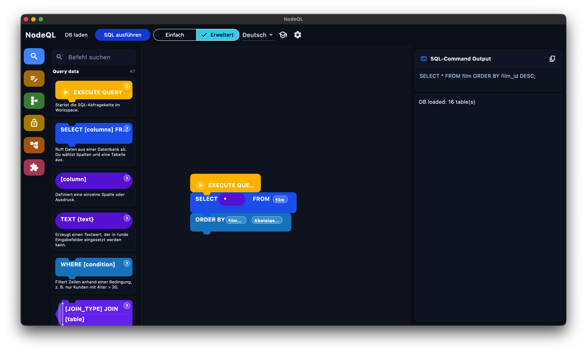
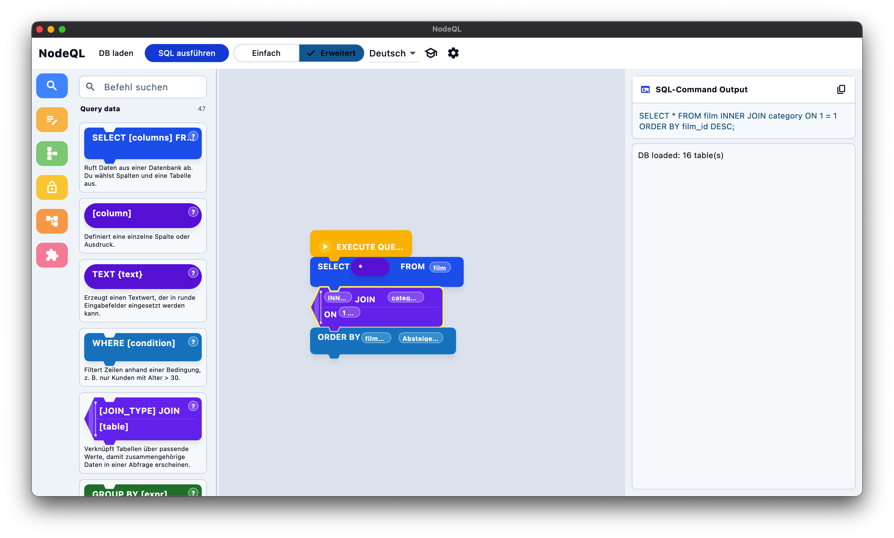
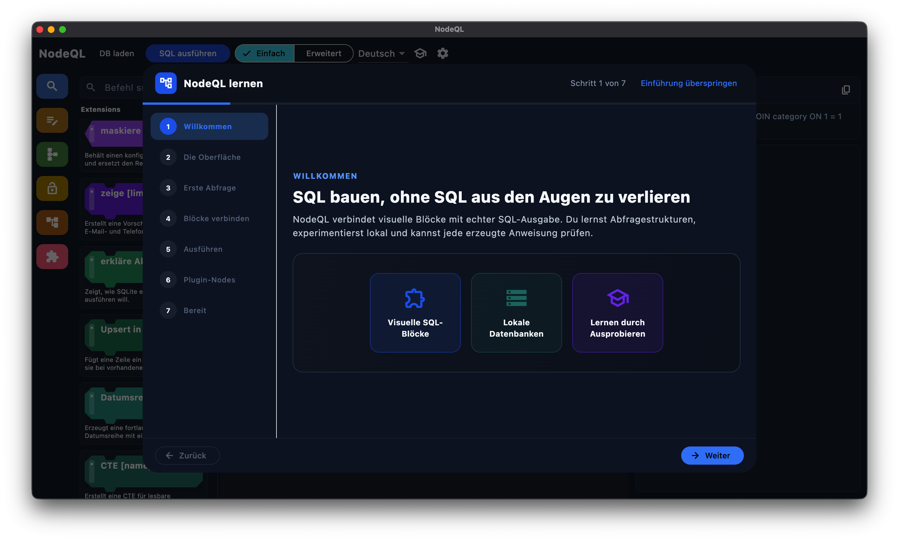
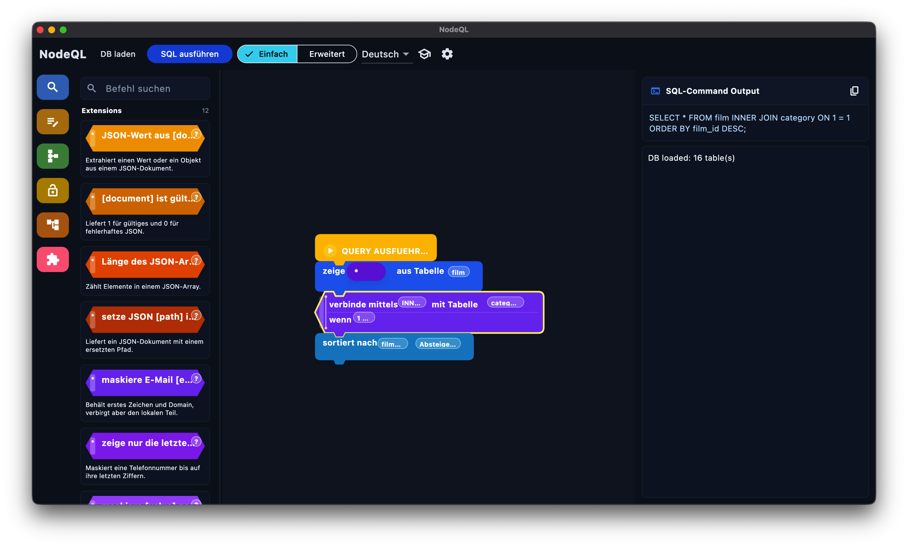

# NodeQL

NodeQL is a local-first desktop application for learning, designing, and
running SQL with visual blocks. Projects, settings, plugins, and databases
remain on the user's device.

> **Release status:** public preview. Linux x64, macOS, and Windows x64 are the
> supported release targets. Published binaries are currently unsigned; see
> [Releasing](docs/RELEASING.md) before describing a build as generally
> available.

## App-Gallery

<table>
  <tr>
    <td width="50%" align="center">
      <a href="docs/screenshots/darkmode-preview.png">
        
      </a>
      <br><strong>Dark Mode</strong>
    </td>
    <td width="50%" align="center">
      <a href="docs/screenshots/whitemode-preview.png">
        
      </a>
      <br><strong>White Mode</strong>
    </td>
  </tr>
  <tr>
    <td width="50%" align="center">
      <a href="docs/screenshots/NodeQL-Einfuehrung.png">
        
      </a>
      <br><strong>Interactive Tutorial</strong>
    </td>
    <td width="50%" align="center">
      <a href="docs/screenshots/Plugins.png">
        
      </a>
      <br><strong>Plugin Ecosystem</strong>
    </td>
  </tr>
</table>

Additional screenshots and contribution guidance are available in
[docs/screenshots](docs/screenshots/README.md).

## Features

- Visual SQL blocks with snapping, editing, compilation, and execution.
- Local SQLite database access without a separate system CLI.
- Versioned JSON project files, recent projects, per-project autosave, and
  guided upgrades of supported legacy project files with automatic backups.
- Declarative Plugin SDK v2 with visual blocks, external data-source adapters,
  SHA-256-verified community repositories, validation, and compatibility checks.
- English fallback with installable, validated community language packages.
- Offline use after installation; no account, analytics, or cloud dependency.
- GitHub-based update checks and community translation contributions.

## Privacy and security

NodeQL does not include analytics, advertising, account tracking, or automatic
crash reporting. The optional network behavior is documented in
[PRIVACY.md](PRIVACY.md). Vulnerabilities should be reported according to
[SECURITY.md](SECURITY.md), not through public issues.

Plugin API v2 is declarative. It does not execute third-party Dart code, native
libraries, scripts, or executables. Translation packages are restricted to
approved HTTPS hosts and verified by schema, size, metadata, placeholders, and
SHA-256.

## Example plugin repository

NodeQL can install community plugin catalogs from static HTTPS URLs. The
official example repository can be added in **Settings > Manage Plugins >
Repositories**:

```text
https://kartoffelspalt.github.io/nodeql-example-plugins/repository.catalog.json
```

The repository demonstrates the public catalog format and SDK example plugins.

## Development

Requirements:

- Flutter `3.44.1`
- Dart compatible with SDK `^3.9.0`
- Native Flutter desktop build dependencies for the target platform

```bash
flutter pub get
flutter gen-l10n
dart format lib test tool
flutter analyze
flutter test
dart run tool/validate_translations.dart
flutter run -d macos
```

Use `windows` or `linux` instead of `macos` on the corresponding platform.

## Project structure

- `lib/core`: application bootstrap, themes, and update checks
- `lib/localization`: runtime catalogs, cache, validation, and locale state
- `lib/domain`: project and block models
- `lib/data`: JSON persistence and defaults
- `lib/engine`: runtime, block, workspace, stage, and extension contracts
- `lib/features`: workbench presentation and feature state
- `docs/plugins`: external plugin SDK and schema documentation
- `docs/localization`: translation contribution and package documentation
- `test`: unit and widget tests

## Community

- [Contributing](CONTRIBUTING.md)
- [Plugin SDK](docs/plugins/README.md)
- [Translation guide](docs/localization/README.md)
- [Release process](docs/RELEASING.md)
- [0.3.3 release notes](docs/releases/v0.3.3.md)
- [Changelog](CHANGELOG.md)
- [Trademark policy](TRADEMARKS.md)

NodeQL source code is available under the [MIT License](LICENSE). Runtime
translation contributions are provided under CC BY 4.0. The NodeQL name and
logo are not licensed under the MIT License; see [TRADEMARKS.md](TRADEMARKS.md).
