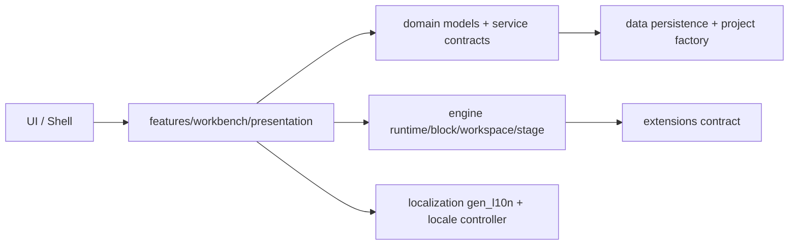

# NodeQL

NodeQL is a multilingual, desktop-first visual programming platform inspired by Scratch workflows, implemented with original code and assets.

## Current Iteration Scope

This iteration provides a production-oriented foundation with:
- clean architecture folder boundaries
- runtime scheduler core
- block metadata + serialization core
- workspace docking service core
- stage state core
- JSON project model + repository contract
- extension registration contract
- external manifest-based plugin SDK
- full `gen_l10n` setup for 11 languages (including Arabic RTL)
- baseline tests for runtime, serialization, localization, and workspace logic

## Architecture



## Folder Structure

- `lib/core`: app bootstrap and theme
- `lib/localization`: locale state + language metadata
- `lib/domain`: business models and repository interfaces
- `lib/data`: persistence and project defaults
- `lib/engine`: runtime, block, workspace, stage, extensions
- `lib/features`: feature-level presentation and state wiring
- `lib/ui`: shell-level entry widgets
- `test`: unit and widget tests per subsystem
- `docs/plugins`: external plugin SDK, JSON schema, and format reference
- `examples/plugins`: installable example plugins

## Internationalization

Implemented with Flutter `gen_l10n` + ARB files:
- German (`de`)
- English (`en`)
- French (`fr`)
- Spanish (`es`)
- Italian (`it`)
- Portuguese (`pt`)
- Turkish (`tr`)
- Arabic (`ar`, RTL)
- Japanese (`ja`)
- Korean (`ko`)
- Chinese (`zh`)

All displayed UI texts and block labels are localized via ARB keys.

## Run

```bash
flutter pub get
flutter gen-l10n
flutter test
flutter run -d macos   # or windows/linux
```

## External Plugins

NodeQL loads independent JSON plugin packages at runtime; plugin developers do
not need Dart or Flutter. Plugins can define localized visual blocks, typed
inputs, colors, container behavior, and SQL templates. See
[`docs/plugins/README.md`](docs/plugins/README.md).

## Next TODO Iterations

- implement block drag/drop graph editor + snapping visuals
- runtime coroutine model with deterministic scheduling slices
- stage renderer with costumes/sounds/input events
- autosave, crash recovery, backup versions
- desktop menus, shortcuts, dockable/resizable panels
- performance profiling for thousands of blocks
